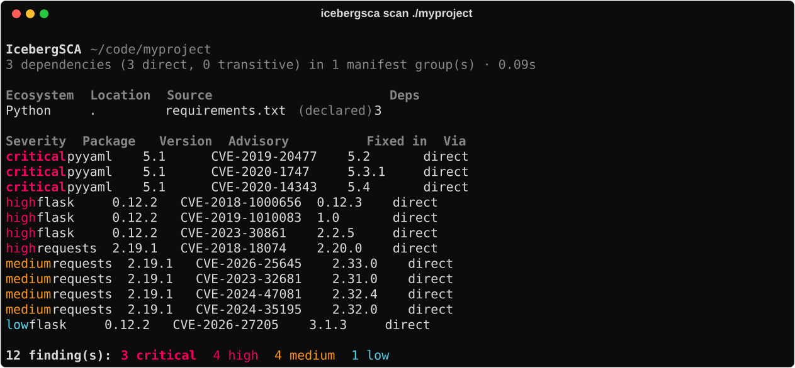

# IcebergSCA

Supply chain analysis for software projects. Point it at a directory; it finds every
dependency manifest and lockfile, builds the direct and transitive dependency set, looks each
package up in [OSV](https://osv.dev), and reports what it finds.



## Install

It's a CLI application, not a library dependency — install it as a tool:

```bash
uv tool install icebergsca      # or: uvx icebergsca scan .
pipx install icebergsca
```

## Usage

```bash
icebergsca scan ./myproject
icebergsca scan ./myproject --format json --output report.json
icebergsca scan ./myproject --include-dev
icebergsca scan ./myproject --ecosystem pypi,npm --exclude 'fixtures/**'
icebergsca scan ./requirements.txt            # a single file works too

icebergsca sbom ./myproject                    # CycloneDX 1.6, components only
icebergsca sbom ./myproject --with-vulnerabilities  # ...plus a VEX section

icebergsca cache info | clear | prune
```

Report output goes to stdout and logs go to stderr, so `--format json | jq` is always clean.

A monorepo produces one merged report, grouped by manifest, with every finding carrying the
files that introduced it:


## Design

**Lockfile-first.** Where a lockfile exists, the resolved graph is read directly from it — so
the report describes what is actually installed, not what would resolve today. Only when no
lockfile is present does it fall back to resolving version ranges against the registry, and
those findings are labelled `resolved` rather than `pinned`. Java, which has no lockfile, gets
its graph reconstructed from Maven Central and is marked `~` for approximate.

**It never claims to be clean when it isn't.** This is the design constraint everything else
bends around:

- An empty findings list because the lookup never ran is reported as *"vulnerability lookup did
  not run"*, never as *"no vulnerabilities found"*. The JSON carries an explicit
  `vulnerabilities_checked` flag, and the SBOM an `icebergsca:vulnerabilitiesChecked` property.
- Packages OSV could not be asked about are listed individually as unchecked.
- If OSV is unreachable, expired cache entries are used and labelled as stale rather than
  silently returning nothing.
- A lockfile that fails to parse falls back to its manifest *with a warning* that the versions
  are declared rather than installed.
- Skipped files, truncated graphs and unresolved constraints are all counted and shown.

**Findings never fail your build.**

| Exit code | Meaning |
|---|---|
| `0` | Scan completed. Vulnerabilities may have been found — that is not an error |
| `1` | Scan failed, or completed only partially — some files or packages went unchecked |
| `2` | Usage error: bad flag, unknown format (Click's reserved code) |

Severity-based CI gating (`--fail-on`) is planned; the report model already carries everything
needed for it.

## Ecosystem support

| Ecosystem | Manifests | Lockfiles | Graph edges |
|---|---|---|---|
| Python | `requirements*.txt`, `pyproject.toml`, `setup.cfg`, `Pipfile` | `uv.lock`, `poetry.lock`, `Pipfile.lock` | yes |
| npm | `package.json` | `package-lock.json` (v1–v3), `pnpm-lock.yaml`, `yarn.lock` (v1 + Berry) | yes |
| Maven / Gradle | `pom.xml`, `build.gradle(.kts)` | *none* — resolved from Central | yes (approximate) |
| Go | — | `go.mod` (already MVS-resolved) | no |
| Rust | `Cargo.toml` | `Cargo.lock` | yes |
| .NET | `*.csproj`, `packages.config` | `packages.lock.json` | yes |
| Ruby | `Gemfile`, `*.gemspec` | `Gemfile.lock` | yes |

`go.sum` is deliberately not used: it lists every version *considered* during resolution, not
the ones selected, so scanning it reports vulnerabilities in code that was never built.

## Output formats

| `--format` | Use |
|---|---|
| `table` | Human-readable terminal output (default) |
| `json` | Full-fidelity document — every dependency, finding, source and warning |
| `csv` | One row per finding per introducing manifest, for spreadsheets |
| `sarif` | SARIF 2.1.0 for GitHub code scanning, with stable fingerprints |
| `cyclonedx` | CycloneDX 1.6 — an SBOM and VEX document in one file |

SARIF and CycloneDX are validated against the official published schemas in the test suite.

### GitHub Actions

```yaml
- run: uvx icebergsca scan . --format sarif --output icebergsca.sarif
- uses: github/codeql-action/upload-sarif@v3
  with:
    sarif_file: icebergsca.sarif
```

## For AI agents

IcebergSCA ships an agent skill inside the package, following the same convention as FastAPI,
Typer and SQLModel:

```
icebergsca/.agents/skills/icebergsca/SKILL.md
                                    /references/json-report.md
                                    /references/ci-integration.md
```

Agents that glob site-packages for `SKILL.md` will find it automatically after install. It
covers invocation, the JSON schema, exit-code semantics, and — most importantly — the three
fields that must be checked before reporting a project as clean. An empty `findings` array
means "checked and clean", "never checked" or "partially checked", and only the report can say
which.

## Caching

Results are cached in SQLite under the per-user cache directory. Advisory detail is keyed by
the `modified` timestamp OSV returns, so a revised advisory lands under a new key — exact
invalidation rather than a guessed TTL. `--offline` serves cache only and reports anything
uncached as unchecked; `--refresh` discards it first.

## Development

```bash
uv sync --extra dev
uv run ruff check . && uv run ruff format --check .
uv run mypy
uv run pytest
```

The test suite never touches the network: an autouse fixture replaces the HTTP client with a
mock transport that 404s anything not explicitly stubbed, so a test that reaches out fails
rather than passing for the wrong reason.

## License

Apache License 2.0 — see [LICENSE](LICENSE) and [NOTICE](NOTICE).
