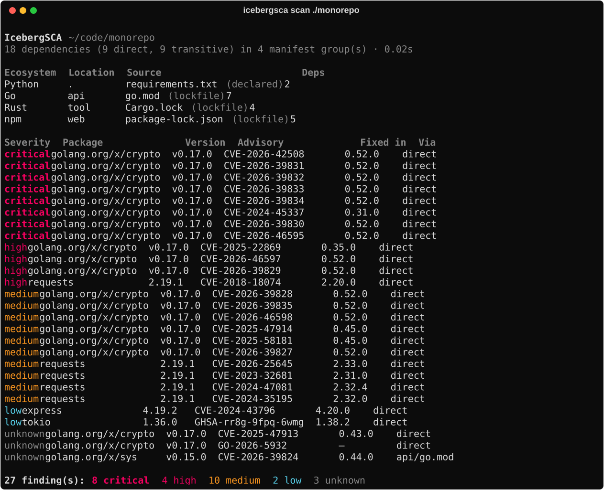

<div class="iceberg-hero" markdown>


<p class="eyebrow">Supply chain analysis</p>

Find. Resolve. Check. Report.

<p class="tagline" markdown>
Point IcebergSCA at a directory. It finds every dependency manifest and
lockfile, builds the direct and transitive dependency set, looks each package up
in **OSV**, and reports what it finds — including, precisely, everything it
could **not** check.
</p>

<div class="hero-cta" markdown>
[How it works](how-it-works.md){ .md-button .md-button--primary }
[CLI reference](cli.md){ .md-button }
[View on GitHub](https://github.com/IcebergAI/IcebergSCA){ .md-button }
</div>

</div>

## Install and scan

```bash
uv tool install icebergsca      # or run it ad hoc: uvx icebergsca scan .
pipx install icebergsca

icebergsca scan ./myproject
```

It is a CLI application, not a library — install it as a tool rather than adding
it to the dependency tree it is meant to be auditing.

{ .term }

## The one rule

A scanner is only worth running if you can trust its silence. Most of the design
here follows from a single constraint: **never imply a clean result the tool did
not earn.**

An empty findings list means one of three very different things — checked and
clean, never checked, or partially checked — and only the report can say which.
So IcebergSCA says which:

- The OSV lookup not running is reported as *"vulnerability lookup did not
  run"*, never as *"no vulnerabilities found"*. JSON carries an explicit
  `vulnerabilities_checked` flag; the SBOM carries an
  `icebergsca:vulnerabilitiesChecked` property.
- Packages OSV could not be asked about are listed individually as unchecked,
  not folded into a total.
- If OSV is unreachable, expired cache entries are served and **labelled stale**
  rather than quietly returning nothing.
- A lockfile that fails to parse falls back to its manifest *with a warning*
  that the versions are declared rather than installed.
- Skipped files, truncated graphs and unresolved constraints are counted and
  shown.

[:octicons-arrow-right-24: How a scan decides what it knows](how-it-works.md)

<div class="grid cards" markdown>

-   :material-lock-check-outline: __Lockfile-first__

    ---

    Where a lockfile exists the resolved graph is read straight from it, so the
    report describes what is actually installed — not what would resolve today.
    Only without one does it fall back to resolving ranges against the registry,
    and those findings are labelled `resolved` rather than `pinned`.

    [:octicons-arrow-right-24: Pinned, resolved, unresolved](how-it-works.md#how-much-to-trust-a-version)

-   :material-package-variant-closed: __Seven ecosystems, one report__

    ---

    Python, npm, Maven/Gradle, Go, Rust, .NET and Ruby — manifests and lockfiles
    both. A monorepo produces one merged report grouped by manifest, with every
    finding carrying the files that introduced it.

    [:octicons-arrow-right-24: Ecosystem support](ecosystems.md)

-   :material-file-tree: __Real dependency graphs__

    ---

    Transitive edges, parent chains and scope propagated as the most-included
    value across every path — so a package reachable from a runtime dependency
    is never hidden behind a dev edge.

    [:octicons-arrow-right-24: The five stages](how-it-works.md#the-five-stages)

-   :material-export-variant: __Five output formats__

    ---

    `table` for humans, `json` for everything else, plus `csv`, SARIF 2.1.0 for
    GitHub code scanning, and CycloneDX 1.6 that doubles as a VEX document.
    SARIF and CycloneDX are validated against the official schemas in the test
    suite.

    [:octicons-arrow-right-24: Output and CI](output.md)

-   :material-gate-alert: __Findings never fail your build__

    ---

    Exit `0` means the scan completed, findings or not. A non-zero exit always
    means the tool could not do its job — so nobody ever appends `|| true` and
    silences genuine failures along with the noise.

    [:octicons-arrow-right-24: Exit codes](output.md#exit-codes)

-   :material-robot-outline: __A skill for coding agents__

    ---

    A skill ships inside the wheel, the way FastAPI, Typer and SQLModel do.
    Agents that glob site-packages find it after install: invocation, the JSON
    schema, exit-code semantics, and the three fields to check before calling a
    project clean.

    [:octicons-arrow-right-24: For AI agents](agents.md)

</div>

## Built to be scanned as well as to scan

A supply chain scanner with a large dependency tree of its own is a poor
advertisement. Ranges, SARIF and CycloneDX are hand-written rather than pulled
from packages, correctness held by schema validation against the official
schemas. Maven graphs are reconstructed from Central rather than shelling out to
`mvn`, because running a project's build to discover its dependencies is itself
a supply chain risk. CI scans this repository with the tool on every run.

{ .term }
